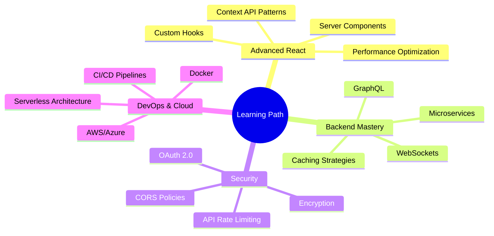

<div align="center">

# 👋 Hi, I'm EverbestDev

### 🚀 MERN Stack Developer | Architecting Scalable, Full-Stack Web Solutions

<p>
  <a href="mailto:theeverbeststudios@gmail.com">
    
  </a>
  <a href="https://linkedin.com/in/everbest-studios">
    
  </a>
  <a href="https://github.com/Everbest">
    
  </a>
</p>


</div>

---

## 🧑‍💻 **About Me**

```javascript
const everbestDev = {
    role: "Full-Stack Developer",
    currentFocus: ["MERN Stack", "Cloud Architecture", "Web Security"],
    languages: ["JavaScript", "TypeScript", "HTML5", "CSS3"],
    passion: "Building scalable solutions that solve real-world problems",
    philosophy: "Clean code is not written by following a set of rules. 
                 You know you're working on clean code when each routine 
                 turns out to be pretty much what you expected.",
    location: "Nigeria 🇳🇬",
    openToWork: true
};
```

I'm a dedicated **MERN Stack Developer** with a passion for creating **functional, high-performance, and scalable web applications**. My approach combines technical excellence with user-centric design, ensuring every project delivers both robust functionality and exceptional user experience.

---

## 🛠️ **Technology Arsenal**

<table>
<tr>
<td valign="top" width="50%">

### **Frontend**


</td>
<td valign="top" width="50%">

### **Backend & Database**


</td>
</tr>
<tr>
<td valign="top" width="50%">

### **Tools & Workflow**


</td>
<td valign="top" width="50%">

### **Design & Prototyping**


</td>
</tr>
</table>

---

## 💼 **Featured Projects**

<table>
<tr>
<td width="50%">

### 🌐 **ILI-Nigeria Platform**
**Full-Stack MERN Application**

A comprehensive multilingual management platform designed for a professional translation and interpretation company.

**Key Features:**
- 🔐 Secure JWT Authentication
- 🌍 Multi-language Support
- 📊 Admin Dashboard
- 📱 Responsive Design
- ⚡ Real-time Updates

**Tech Stack:** React • Node.js • Express • MongoDB • Tailwind CSS

🚧 **Status:** In Active Development

</td>
<td width="50%">

### 🎓 **WeTest-Edu**
**Interactive Learning Platform**

An engaging quiz platform inspired by Kahoot!, designed to make learning interactive and fun.

**Key Features:**
- ⏱️ Real-time Quizzes
- 🎯 Score Tracking
- 🎨 Modern UI/UX
- 📊 Analytics Dashboard
- 🏆 Leaderboard System

**Tech Stack:** HTML5 • CSS3 • Vanilla JavaScript

🚧 **Status:** In Active Development

</td>
</tr>
<tr>
<td width="50%">

### 📝 **Functional Quiz App**
**Dynamic Quiz Application**

A fully functional quiz application with custom animations and comprehensive score tracking.

**Key Features:**
- ✨ Custom Animations
- 📈 Progress Tracking
- 🎯 Dynamic Questions
- 💾 Local Storage
- 🎨 Smooth Transitions

**Tech Stack:** HTML5 • JavaScript • CSS3

✅ **Status:** Completed

</td>
<td width="50%">

### 🚀 **More Coming Soon...**

Currently working on exciting new projects involving:
- Cloud deployment with AWS/Vercel
- Microservices architecture
- Advanced state management
- Real-time collaboration features

**Stay tuned!** ⭐

</td>
</tr>
</table>

---

## 🎯 **Current Development Focus**



<details>
<summary><b>📚 Detailed Learning Roadmap</b></summary>

### **Q1 2025 Goals**
- ✅ Master React Performance Optimization
- 🔄 Implement Microservices Architecture
- 🔄 Deploy Production-Ready MERN Apps
- 📅 Learn Docker & Containerization
- 📅 Explore TypeScript Advanced Patterns

### **Q2 2025 Goals**
- 📅 Cloud Architecture (AWS/Azure)
- 📅 GraphQL Integration
- 📅 Testing (Jest, React Testing Library)
- 📅 CI/CD Pipeline Setup

</details>

---

## 📊 **GitHub Analytics**

<div align="center">


</div>

---

## 📈 **Contribution Graph**

<div align="center">

[](https://github.com/EverbestDev)

</div>

---

## 🏆 **GitHub Trophies**

<div align="center">

[](https://github.com/EverbestDev)

</div>

---

## 💡 **Development Philosophy**

> **"Code is like humor. When you have to explain it, it's bad."** – Cory House

<table>
<tr>
<td width="33%" align="center">

### 🎯 **Quality First**
Writing clean, maintainable code that stands the test of time

</td>
<td width="33%" align="center">

### 🚀 **User-Centric**
Building solutions that prioritize user experience and accessibility

</td>
<td width="33%" align="center">

### 📚 **Continuous Learning**
Staying updated with latest technologies and best practices

</td>
</tr>
</table>

---

## 🤝 **Let's Connect & Collaborate**

<div align="center">

I'm always open to interesting conversations and collaboration opportunities!

<table>
<tr>
<td align="center" width="33%">

### 📧 **Email**
[theeverbeststudios@gmail.com](mailto:theeverbeststudios@gmail.com)

</td>
<td align="center" width="33%">

### 💼 **LinkedIn**
[Everbest Studios](https://linkedin.com/in/everbest-studios)

</td>
<td align="center" width="33%">

### 🐙 **GitHub**
[@EverbestDev](https://github.com/EverbestDev)

</td>
</tr>
</table>

### **Open to:**
✨ Freelance Projects | 💼 Full-Time Opportunities | 🤝 Open Source Collaboration | 📖 Tech Discussions

</div>

---

<div align="center">

### 💭 **Quote of the Day**


---

**✨ Thanks for visiting! Feel free to star ⭐ my repositories if you find them interesting!**


</div>
