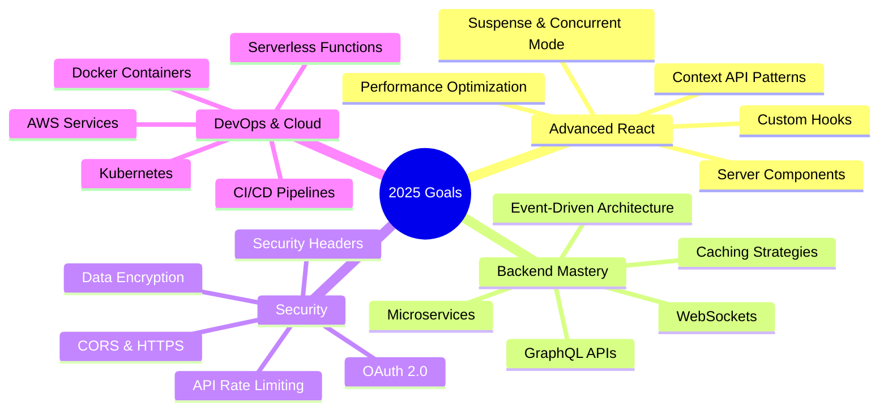

<div align="center">


# 👋 Hi, I'm EverbestDev

### 🚀 MERN Stack Developer | Architecting Scalable, Full-Stack Web Solutions


<p>
  <a href="mailto:theeverbeststudios@gmail.com">
    
  </a>
  <a href="https://linkedin.com/in/everbest-studios">
    
  </a>
  <a href="https://github.com/EverbestDev">
    
  </a>
  <a href="https://twitter.com/EverbestDev">
    
  </a>
</p>


</div>

---

## 🧑‍💻 **About Me**


```javascript
const everbestDev = {
    role: "Full-Stack Developer",
    currentFocus: ["MERN Stack", "Cloud Architecture", "Web Security"],
    languages: ["JavaScript", "TypeScript", "HTML5", "CSS3"],
    frameworks: ["React", "Node.js", "Express", "MongoDB"],
    passion: "Building scalable solutions that solve real-world problems",
    philosophy: "Clean code is not written by following a set of rules. 
                 You know you're working on clean code when each routine 
                 turns out to be pretty much what you expected.",
    location: "Nigeria 🇳🇬",
    timezone: "WAT (GMT+1)",
    openToWork: true,
    funFact: "I debug with console.log() and I'm not ashamed! 😄"
};
```

I'm a dedicated **MERN Stack Developer** with a passion for creating **functional, high-performance, and scalable web applications**. My approach combines technical excellence with user-centric design, ensuring every project delivers both robust functionality and exceptional user experience.

🌱 Currently learning **Docker, Kubernetes & Cloud Architecture**  
💬 Ask me about **React, Node.js, MongoDB, and Full-Stack Development**  
⚡ Fun fact: **I turn coffee into code!** ☕→💻

---

## 🛠️ **Technology Arsenal**

<div align="center">


</div>

<table>
<tr>
<td valign="top" width="50%">

### **Frontend Development**


</td>
<td valign="top" width="50%">

### **Backend & Database**


</td>
</tr>
<tr>
<td valign="top" width="50%">

### **Tools & Workflow**


</td>
<td valign="top" width="50%">

### **Design & Cloud**


</td>
</tr>
</table>

---

## 💼 **Featured Projects**

<div align="center">

</div>

<table>
<tr>
<td width="50%">

### 🌐 **ILI-Nigeria Platform**
**Full-Stack MERN Application**

A comprehensive multilingual management platform designed for a professional translation and interpretation company.

**Key Features:**
- 🔐 Secure JWT Authentication
- 🌍 Multi-language Support
- 📊 Admin Dashboard with Analytics
- 📱 Fully Responsive Design
- ⚡ Real-time Updates & Notifications
- 🎨 Modern UI/UX with Tailwind CSS

**Tech Stack:** React • Node.js • Express • MongoDB • Tailwind CSS • Redux

🚧 **Status:** In Active Development

[View Demo](#) | [Source Code](#)

</td>
<td width="50%">

### 🎓 **WeTest-Edu**
**Interactive Learning Platform**

An engaging quiz platform inspired by Kahoot!, designed to make learning interactive and fun.

**Key Features:**
- ⏱️ Real-time Quiz Sessions
- 🎯 Advanced Score Tracking
- 🎨 Modern & Intuitive UI/UX
- 📊 Comprehensive Analytics Dashboard
- 🏆 Dynamic Leaderboard System
- 👥 Multiplayer Support

**Tech Stack:** HTML5 • CSS3 • Vanilla JavaScript • Local Storage

🚧 **Status:** In Active Development

[View Demo](#) | [Source Code](#)

</td>
</tr>
<tr>
<td width="50%">

### 📝 **Functional Quiz App**
**Dynamic Quiz Application**

A fully functional quiz application with custom animations and comprehensive score tracking.

**Key Features:**
- ✨ Smooth Custom Animations
- 📈 Real-time Progress Tracking
- 🎯 Dynamic Question Loading
- 💾 Persistent Local Storage
- 🎨 Responsive Transitions
- 🔄 Answer Review System

**Tech Stack:** HTML5 • JavaScript • CSS3 • Animation API

✅ **Status:** Completed & Deployed

[Live Demo](#) | [Source Code](#)

</td>
<td width="50%">

### 🔐 **Auth System Template**
**Secure Authentication Boilerplate**

A production-ready authentication system with best security practices.

**Key Features:**
- 🔒 JWT + Refresh Tokens
- 📧 Email Verification
- 🔑 Password Reset Flow
- 🛡️ CSRF Protection
- 🚀 Rate Limiting
- 📱 2FA Support

**Tech Stack:** Node.js • Express • MongoDB • JWT • Bcrypt

✅ **Status:** Completed

[Source Code](#)

</td>
</tr>
</table>

<div align="center">

### 🚀 **More Projects Coming Soon...**

Working on exciting projects involving Cloud Deployment, Microservices, Real-time Collaboration & AI Integration!

</div>

---

## 🎯 **Current Development Focus**

<div align="center">

</div>


```mermaid
mindmap
  root((2025 Goals))
    Advanced React
      Custom Hooks
      Performance Optimization
      Context API Patterns
      Server Components
      Suspense & Concurrent Mode
    Backend Mastery
      Microservices
      GraphQL APIs
      WebSockets
      Caching Strategies
      Event-Driven Architecture
    Security
      OAuth 2.0
      API Rate Limiting
      Data Encryption
      CORS & HTTPS
      Security Headers
    DevOps & Cloud
      Docker Containers
      CI/CD Pipelines
      AWS Services
      Kubernetes
      Serverless Functions
```

<details>
<summary><b>📚 Detailed Learning Roadmap 2025</b></summary>

<br>

### **Q1 2025 Goals** ✅
- ✅ Master React Performance Optimization
- ✅ Build Production-Ready REST APIs
- 🔄 Implement Microservices Architecture
- 🔄 Deploy MERN Apps to Cloud
- 📅 Master Docker Containerization
- 📅 Explore TypeScript Advanced Patterns

### **Q2 2025 Goals**
- 📅 AWS/Azure Cloud Architecture
- 📅 GraphQL Integration & Best Practices
- 📅 Testing (Jest, React Testing Library, Supertest)
- 📅 CI/CD Pipeline with GitHub Actions
- 📅 WebSocket & Real-time Features

### **Q3 2025 Goals**
- 📅 Kubernetes Orchestration
- 📅 Serverless Architecture (AWS Lambda)
- 📅 Redis Caching Implementation
- 📅 Message Queues (RabbitMQ/Kafka)

### **Q4 2025 Goals**
- 📅 AI/ML Integration in Web Apps
- 📅 Advanced System Design
- 📅 Open Source Contributions
- 📅 Tech Blog & Content Creation

</details>

---

## 📊 **GitHub Analytics**

<div align="center">


### **GitHub Statistics**

<p align="center">
  
  
</p>

<p align="center">
  
  
</p>

</div>

---

## 📈 **Contribution Graph**

<div align="center">

[](https://github.com/EverbestDev)

</div>

---

## 🏆 **GitHub Trophies**

<div align="center">


</div>

---

## 📊 **Coding Activity & Stats**

<div align="center">

### **Weekly Development Breakdown**

<!--START_SECTION:waka-->
<!--END_SECTION:waka-->

<table>
<tr>
<td align="center" width="33%">

**💻 Total Commits**  


</td>
<td align="center" width="33%">

**📦 Repositories**  


</td>
<td align="center" width="33%">

**⭐ Stars Earned**  


</td>
</tr>
</table>

</div>

---

## 💡 **Development Philosophy**

<div align="center">

> **"Any fool can write code that a computer can understand. Good programmers write code that humans can understand."** – Martin Fowler

</div>

<table>
<tr>
<td width="25%" align="center">

### 🎯 **Quality First**
Writing clean, maintainable code that stands the test of time

</td>
<td width="25%" align="center">

### 🚀 **User-Centric**
Building solutions that prioritize user experience and accessibility

</td>
<td width="25%" align="center">

### 📚 **Continuous Learning**
Staying updated with latest technologies and best practices

</td>
<td width="25%" align="center">

### 🤝 **Collaboration**
Open source contribution and knowledge sharing

</td>
</tr>
</table>

---

## 🎨 **Skills Visualization**

<div align="center">

### **Proficiency Levels**

```text
React       ████████████████████░   95%
JavaScript  ███████████████████░░   90%
Node.js     ██████████████████░░░   85%
MongoDB     █████████████████░░░░   80%
TypeScript  ████████████████░░░░░   75%
Express     ████████████████░░░░░   75%
TailwindCSS ███████████████░░░░░░   70%
Git/GitHub  ██████████████████░░░   85%
```

</div>

---

## 📚 **Latest Blog Posts**

<div align="center">

<!-- BLOG-POST-LIST:START -->
- 🚀 Building Scalable MERN Applications
- 🔐 Implementing JWT Authentication Best Practices
- ⚡ React Performance Optimization Tips
- 🎨 Modern CSS Techniques for 2025
<!-- BLOG-POST-LIST:END -->

</div>

---

## 🤝 **Let's Connect & Collaborate**

<div align="center">


### I'm always open to interesting conversations and collaboration opportunities!


<table>
<tr>
<td align="center" width="25%">

### 📧 **Email**
[theeverbeststudios@gmail.com](mailto:theeverbeststudios@gmail.com)

</td>
<td align="center" width="25%">

### 💼 **LinkedIn**
[Everbest Studios](https://linkedin.com/in/everbest-studios)

</td>
<td align="center" width="25%">

### 🐙 **GitHub**
[@EverbestDev](https://github.com/EverbestDev)

</td>
<td align="center" width="25%">

### 🐦 **Twitter**
[@EverbestDev](https://twitter.com/EverbestDev)

</td>
</tr>
</table>

### **Open to:**
✨ Freelance Projects | 💼 Full-Time Opportunities | 🤝 Open Source Collaboration | 📖 Tech Discussions | 🎤 Speaking Engagements

### **Support My Work:**

<a href="https://www.buymeacoffee.com/everbestdev">
  
</a>

</div>

---

## 🎮 **Fun Zone**

<div align="center">

### **GitHub Snake Game**


### 💭 **Dev Quote**


### 🎲 **Random Dev Joke**


</div>

---

<div align="center">

### 📝 **Quick Tips**

💡 **Did you know?** You can press `.` on any GitHub repo to open it in VS Code Web!  
💡 **Pro tip:** Use `git commit --amend` to modify your last commit message!  
💡 **Shortcut:** Press `t` in any repo to quickly search for files!

---

### 🎯 **2025 Contribution Goals**


---

**✨ Thanks for visiting! Feel free to explore my repositories and star ⭐ the ones you find interesting!**

**💬 Let's build something amazing together!**


**Last Updated:** January 2025 | **Profile Views:** 

</div>
